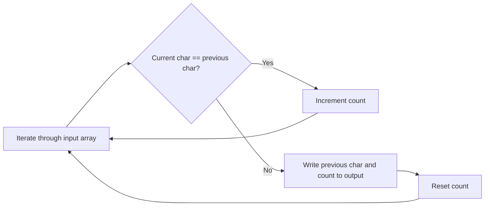

<h2><a href="https://leetcode.com/problems/string-compression">443. String Compression</a></h2>

<p>Given an array of characters <code>chars</code>, compress it using the following algorithm:</p>

<p>Begin with an empty string <code>s</code>. For each group of <strong>consecutive repeating characters</strong> in <code>chars</code>:</p>

<ul>
	<li>If the group's length is <code>1</code>, append the character to <code>s</code>.</li>
	<li>Otherwise, append the character followed by the group's length.</li>
</ul>

<p>The compressed string <code>s</code> <strong>should not be returned separately</strong>, but instead, be stored <strong>in the input character array <code>chars</code></strong>. Note that group lengths that are <code>10</code> or longer will be split into multiple characters in <code>chars</code>.</p>

<p>After you are done <strong>modifying the input array,</strong> return <em>the new length of the array</em>.</p>

<p>You must write an algorithm that uses only constant extra space.</p>

<p><strong>Note: </strong>The characters in the array beyond the returned length do not matter and should be ignored.</p>

<p>&nbsp;</p>
<p><strong class="example">Example 1:</strong></p>

<pre><strong>Input:</strong> chars = ["a","a","b","b","c","c","c"]
<strong>Output:</strong> 6
<strong>Explanation:</strong> The groups are <code>"aa"</code>, <code>"bb"</code>, and <code>"ccc"</code>. This compresses to <code>"a2b2c3"</code>.
After modifying the input array in-place, the first 6 characters of <code>chars</code> should be <code>["a","2","b","2","c","3"]</code>.
</pre>

<p><strong class="example">Example 2:</strong></p>

<pre><strong>Input:</strong> chars = ["a"]
<strong>Output:</strong> 1
<strong>Explanation:</strong> The only group is <code>"a"</code>, which remains uncompressed since it is a single character.
After modifying the input array in-place, the first character of <code>chars</code> should be <code>["a"]</code>.
</pre>

<p><strong class="example">Example 3:</strong></p>

<pre><strong>Input:</strong> chars = ["a","b","b","b","b","b","b","b","b","b","b","b","b"]
<strong>Output:</strong> 4
<strong>Explanation:</strong> The groups are <code>"a"</code> and <code>"bbbbbbbbbbbb"</code>. This compresses to <code>"ab12"</code>.
After modifying the input array in-place, the first 4 characters of <code>chars</code> should be <code>["a","b","1","2"]</code>.
</pre>

<p>&nbsp;</p>
<p><strong>Constraints:</strong></p>

<ul>
	<li><code>1 &lt;= chars.length &lt;= 2000</code></li>
	<li><code>chars[i]</code> is a lowercase English letter, uppercase English letter, digit, or symbol.</li>
</ul>


---

# 🛍️ String-Compression | Explained
## Approach 1: In-Place Compression
### Intuition
The core idea behind this approach is to iterate through the input array of characters and compress sequences of identical characters into a single character followed by the count of occurrences in the sequence. For example, if the input is ["a", "a", "b", "b", "b"], the compressed output would be ["a", "2", "b", "3"]. This approach works because it takes advantage of the fact that the input array is already sorted, allowing us to easily identify sequences of identical characters.

### Algorithm Visualized

### Approach
The approach involves iterating through the input array of characters, keeping track of the current character and the count of occurrences in the current sequence. When a new character is encountered, the previous character and its count are written to the output array, and the count is reset. This process continues until the end of the input array is reached.

### Detailed Code Analysis
The code starts by initializing several variables: `curr_idx` to keep track of the current index in the output array, and `i` and `count` to keep track of the current position in the input array and the count of occurrences in the current sequence, respectively.

The code then enters a loop that iterates through the input array. Inside the loop, it checks whether the current character is different from the previous character, or whether it has reached the end of the input array. If either of these conditions is true, it writes the previous character and its count to the output array.

To write the count to the output array, the code uses a nested loop that converts the count to a string by iteratively taking the last digit of the count (using the modulo operator) and adding it to the output array. The digits are then reversed to form the correct string representation of the count.

Finally, the code resets the count and continues to the next iteration of the loop.

### Code
```cpp
int compress(vector<char> &chars) {
    const size_t n = chars.size();
    size_t curr_idx = 0;
    for (size_t i = 1, count = 1; i <= n; ++i, ++count)
        if (i == n || chars[i] != chars[i - 1]) {
            chars[curr_idx++] = chars[i - 1];
            if (count != 1) {
                size_t count_idx = curr_idx;
                for (; count != 0; count /= 10)
                    chars[curr_idx++] = '0' + count % 10;
                reverse(&chars[count_idx], &chars[curr_idx]);
            }
            count = 0;
        }
    return curr_idx;
}
```
### Complexity
- **Time:** O(n), where n is the number of characters in the input array. This is because the code iterates through the input array once, and the nested loop that converts the count to a string runs in O(log n) time in the worst case (when the count is very large). However, since log n grows much slower than n, the overall time complexity is dominated by the O(n) term.
- **Space:** O(1), because the code only uses a constant amount of extra space to store the current index and count, regardless of the size of the input array. The output is written in-place, so no additional space is required.