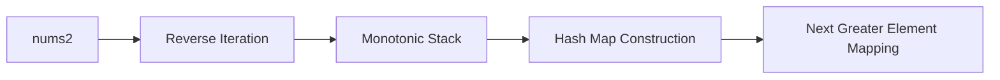

<h2><a href="https://leetcode.com/problems/next-greater-element-i">496. Next Greater Element I</a></h2>

<p>The <strong>next greater element</strong> of some element <code>x</code> in an array is the <strong>first greater</strong> element that is <strong>to the right</strong> of <code>x</code> in the same array.</p>

<p>You are given two <strong>distinct 0-indexed</strong> integer arrays <code>nums1</code> and <code>nums2</code>, where <code>nums1</code> is a subset of <code>nums2</code>.</p>

<p>For each <code>0 &lt;= i &lt; nums1.length</code>, find the index <code>j</code> such that <code>nums1[i] == nums2[j]</code> and determine the <strong>next greater element</strong> of <code>nums2[j]</code> in <code>nums2</code>. If there is no next greater element, then the answer for this query is <code>-1</code>.</p>

<p>Return <em>an array </em><code>ans</code><em> of length </em><code>nums1.length</code><em> such that </em><code>ans[i]</code><em> is the <strong>next greater element</strong> as described above.</em></p>

<p>&nbsp;</p>
<p><strong class="example">Example 1:</strong></p>

<pre><strong>Input:</strong> nums1 = [4,1,2], nums2 = [1,3,4,2]
<strong>Output:</strong> [-1,3,-1]
<strong>Explanation:</strong> The next greater element for each value of nums1 is as follows:
- 4 is underlined in nums2 = [1,3,<u>4</u>,2]. There is no next greater element, so the answer is -1.
- 1 is underlined in nums2 = [<u>1</u>,3,4,2]. The next greater element is 3.
- 2 is underlined in nums2 = [1,3,4,<u>2</u>]. There is no next greater element, so the answer is -1.
</pre>

<p><strong class="example">Example 2:</strong></p>

<pre><strong>Input:</strong> nums1 = [2,4], nums2 = [1,2,3,4]
<strong>Output:</strong> [3,-1]
<strong>Explanation:</strong> The next greater element for each value of nums1 is as follows:
- 2 is underlined in nums2 = [1,<u>2</u>,3,4]. The next greater element is 3.
- 4 is underlined in nums2 = [1,2,3,<u>4</u>]. There is no next greater element, so the answer is -1.
</pre>

<p>&nbsp;</p>
<p><strong>Constraints:</strong></p>

<ul>
	<li><code>1 &lt;= nums1.length &lt;= nums2.length &lt;= 1000</code></li>
	<li><code>0 &lt;= nums1[i], nums2[i] &lt;= 10<sup>4</sup></code></li>
	<li>All integers in <code>nums1</code> and <code>nums2</code> are <strong>unique</strong>.</li>
	<li>All the integers of <code>nums1</code> also appear in <code>nums2</code>.</li>
</ul>

<p>&nbsp;</p>
<strong>Follow up:</strong> Could you find an <code>O(nums1.length + nums2.length)</code> solution?

---

# 🛍️ Next-Greater-Element-I | Explained

## Approach 1: Monotonic Stack with Hash Map
### Intuition
The core idea behind this approach is to use a monotonic stack to efficiently find the next greater element for each element in `nums2`. By iterating over `nums2` in reverse order and utilizing a stack to keep track of the elements that do not have a greater element yet, we can construct a hash map that maps each element to its next greater element. This approach works because it ensures that the stack always contains elements in decreasing order, allowing us to easily find the next greater element for each element.

### Algorithm Visualized


### Approach
The approach involves the following high-level steps:
1. Initialize an empty stack and a hash map to store the next greater element for each element.
2. Iterate over `nums2` in reverse order.
3. For each element, pop all elements from the stack that are less than or equal to the current element.
4. If the stack is empty after popping, it means there is no greater element for the current element, so we map it to -1 in the hash map.
5. Otherwise, we map the current element to the top element of the stack, which is its next greater element.
6. Push the current element onto the stack to maintain the monotonic property.
7. After constructing the hash map, iterate over `nums1` and use the hash map to find the next greater element for each element.

### Detailed Code Analysis
Let's dive into the code:
- Lines 3-4: Initialize an empty stack `st` and a hash map `map` to store the next greater element for each element.
- Lines 6-19: Iterate over `nums2` in reverse order using a for loop.
  - Line 8: While the stack is not empty and the top element of the stack is less than or equal to the current element, pop the top element from the stack. This ensures that the stack always contains elements in decreasing order.
  - Line 12: If the stack is empty after popping, it means there is no greater element for the current element, so we map it to -1 in the hash map.
  - Line 15: Otherwise, we map the current element to the top element of the stack, which is its next greater element.
  - Line 18: Push the current element onto the stack to maintain the monotonic property.
- Lines 21-24: Iterate over `nums1` and use the hash map to find the next greater element for each element. The result is stored in the `ans` array.

### Code
```java
class Solution {
    public int[] nextGreaterElement(int[] nums1, int[] nums2) {
        Stack<Integer> st = new Stack<>();
        HashMap<Integer, Integer> map = new HashMap<>();

        for (int i = nums2.length - 1; i >= 0; i--) {
            while (!st.isEmpty() && st.peek() <= nums2[i]) {
                st.pop();
            }

            if (st.isEmpty()) {
                map.put(nums2[i], -1);
            } else {
                map.put(nums2[i], st.peek());
            }

            st.push(nums2[i]);
        }

        int[] ans = new int[nums1.length];
        for (int i = 0; i < nums1.length; i++) {
            ans[i] = map.get(nums1[i]);
        }

        return ans;
    }
}
```

### Complexity
- **Time:** The time complexity is O(n + m), where n is the length of `nums1` and m is the length of `nums2`. This is because we iterate over `nums2` once to construct the hash map and then iterate over `nums1` once to find the next greater element for each element.
- **Space:** The space complexity is O(m), where m is the length of `nums2`. This is because in the worst case, we might need to store all elements of `nums2` in the hash map. The stack also uses O(m) space in the worst case. The output array uses O(n) space, but this is not included in the space complexity as it is required for the output.

## 🕵️‍♂️ Follow-up Questions (Optional)
Some possible follow-up questions for this pattern include:
- How would you optimize the solution if `nums1` and `nums2` are very large?
  Answer: You could use a more efficient data structure, such as a `TreeMap`, to store the next greater element for each element. However, this would not change the overall time complexity of the solution.
- What if `nums2` is not given, and you only have `nums1`? How would you find the next greater element for each element in `nums1`?
  Answer: You would need to use a different approach, such as using a stack to keep track of the elements that do not have a greater element yet, similar to the original solution. However, you would need to iterate over `nums1` twice, once to construct the stack and once to find the next greater element for each element.