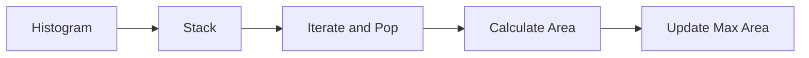

<h2><a href="https://leetcode.com/problems/largest-rectangle-in-histogram">84. Largest Rectangle in Histogram</a></h2>

<p>Given an array of integers <code>heights</code> representing the histogram's bar height where the width of each bar is <code>1</code>, return <em>the area of the largest rectangle in the histogram</em>.</p>

<p>&nbsp;</p>
<p><strong class="example">Example 1:</strong></p>

<pre><strong>Input:</strong> heights = [2,1,5,6,2,3]
<strong>Output:</strong> 10
<strong>Explanation:</strong> The above is a histogram where width of each bar is 1.
The largest rectangle is shown in the red area, which has an area = 10 units.
</pre>

<p><strong class="example">Example 2:</strong></p>

<pre><strong>Input:</strong> heights = [2,4]
<strong>Output:</strong> 4
</pre>

<p>&nbsp;</p>
<p><strong>Constraints:</strong></p>

<ul>
	<li><code>1 &lt;= heights.length &lt;= 10<sup>5</sup></code></li>
	<li><code>0 &lt;= heights[i] &lt;= 10<sup>4</sup></code></li>
</ul>


---

# 🛍️ Largest-Rectangle-in-Histogram | Explained

## Approach 1: Stack-Based Approach
### Intuition
The core idea behind this approach is to use a stack to store the indices of the histogram bars. We start by iterating through the histogram bars from left to right, and for each bar, we keep popping the stack until we find a bar that is smaller than or equal to the current bar. This is because a larger bar cannot be part of the rectangle with a smaller bar. By doing this, we can calculate the area of the rectangle with the popped bar as the smallest bar. This approach works because the stack is used to store the indices of the bars that are still "active" and could potentially be part of a rectangle. By popping the stack when we encounter a smaller bar, we are effectively "closing" the rectangle and calculating its area.

### Algorithm Visualized


### Approach
The algorithm starts by initializing an empty stack and a variable to store the maximum area found so far. It then iterates through the histogram bars from left to right. For each bar, it checks if the stack is not empty and if the current bar is smaller than the bar at the top of the stack. If both conditions are true, it pops the stack, calculates the area of the rectangle with the popped bar as the smallest bar, and updates the maximum area found so far. After popping the stack, it pushes the current index onto the stack. Finally, after iterating through all the bars, it pops the remaining bars from the stack and calculates their areas to find the maximum area.

### Detailed Code Analysis
The code initializes a stack `st` and a variable `maxArea` to store the maximum area found so far. It then iterates through the histogram bars using a `for` loop. Inside the loop, it checks if the stack is not empty `!st.isEmpty()` and if the current bar `heights[i]` is smaller than the bar at the top of the stack `heights[st.peek()]`. If both conditions are true, it pops the stack using `st.pop()`, calculates the area of the rectangle with the popped bar as the smallest bar, and updates the maximum area found so far using `Math.max(maxArea, area)`. The area is calculated using the formula `height * width`, where `height` is the height of the popped bar and `width` is the width of the rectangle. The width is calculated as `i` if the stack is empty after popping, or `i - st.peek() - 1` otherwise. After popping the stack, it pushes the current index `i` onto the stack using `st.push(i)`. Finally, after iterating through all the bars, it pops the remaining bars from the stack and calculates their areas to find the maximum area.

### Code
```java
class Solution {
    public int largestRectangleArea(int[] heights) {
        Stack<Integer> st = new Stack<>();
        int maxArea = 0;

        for(int i=0;i<heights.length;i++){
            while(!st.isEmpty() && heights[i]<heights[st.peek()]){
                int height = heights[st.pop()];
                int width;
                if(st.isEmpty()) width=i;
                else width= i - st.peek() - 1;
                int area = height*width;
                maxArea = Math.max(maxArea,area);
            }
            st.push(i);
        }

        while(!st.isEmpty()){
            int height = heights[st.pop()];
            int width;
            if(st.isEmpty()) width = heights.length;
            else width = heights.length - st.peek() - 1;
            int area = height*width;
            maxArea = Math.max(maxArea,area);
        }
        return maxArea;
    }
}
```

### Complexity
- **Time:** The time complexity of this approach is O(n), where n is the number of bars in the histogram. This is because each bar is pushed and popped from the stack exactly once.
- **Space:** The space complexity of this approach is O(n), where n is the number of bars in the histogram. This is because in the worst-case scenario, all bars are pushed onto the stack.

## 🕵️‍♂️ Follow-up Questions (Optional)
What if the input histogram is empty? The function should return 0, as there are no bars to form a rectangle.
What if the input histogram contains only one bar? The function should return the area of the bar, which is the height of the bar multiplied by 1.