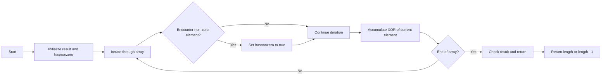

<h2><a href="https://leetcode.com/problems/longest-subsequence-with-non-zero-bitwise-xor">0000. Longest Subsequence With Non Zero Bitwise Xor</a></h2>

<p>You are given an integer array <code>nums</code>.</p>

<p>Return the length of the <strong>longest <span data-keyword="subsequence-array-nonempty" class=" cursor-pointer relative text-dark-blue-s text-sm"><button type="button" aria-haspopup="dialog" aria-expanded="false" aria-controls="radix-_r_s_" data-state="closed" class="">subsequence</button></span></strong> in <code>nums</code> whose bitwise <strong>XOR</strong> is <strong>non-zero</strong>. If no such <strong>subsequence</strong> exists, return 0.</p>

<p>&nbsp;</p>
<p><strong class="example">Example 1:</strong></p>

<div class="example-block">
<p><strong>Input:</strong> <span class="example-io">nums = [1,2,3]</span></p>

<p><strong>Output:</strong> <span class="example-io">2</span></p>

<p><strong>Explanation:</strong></p>

<p>One longest subsequence is <code>[2, 3]</code>. The bitwise XOR is computed as <code>2 XOR 3 = 1</code>, which is non-zero.</p>
</div>

<p><strong class="example">Example 2:</strong></p>

<div class="example-block">
<p><strong>Input:</strong> <span class="example-io">nums = [2,3,4]</span></p>

<p><strong>Output:</strong> <span class="example-io">3</span></p>

<p><strong>Explanation:</strong></p>

<p>The longest subsequence is <code>[2, 3, 4]</code>. The bitwise XOR is computed as <code>2 XOR 3 XOR 4 = 5</code>, which is non-zero.</p>
</div>

<p>&nbsp;</p>
<p><strong>Constraints:</strong></p>

<ul>
	<li><code>1 &lt;= nums.length &lt;= 10<sup>5</sup></code></li>
	<li><code>0 &lt;= nums[i] &lt;= 10<sup>9</sup></code></li>
</ul>


---

# 🛍️ Longest-Subsequence-With-Non-Zero-Bitwise-Xor | Explained

## Approach 1: Bitwise XOR Accumulation
### Intuition
The approach works by utilizing the properties of bitwise XOR operation. In this problem, we aim to find the longest subsequence where the bitwise XOR of all elements is non-zero. The XOR operation has the property that `a ^ a = 0` and `a ^ 0 = a`. This means that if we XOR all elements in the array, a non-zero result indicates the presence of at least one non-zero element. The approach iterates through the array, maintaining a flag to track if any non-zero element is encountered and accumulates the XOR of all elements.

### Algorithm Visualized


### Approach
The algorithm starts by initializing variables to track the result of the XOR operation and a flag to indicate if any non-zero element is encountered. It then iterates through the array, updating the flag and accumulating the XOR of all elements. After iterating through the entire array, it checks the result of the XOR operation and returns the length of the array if the result is non-zero, or the length minus one if the result is zero.

### Detailed Code Analysis
Let's break down the code step by step:
- Line 1: `class Solution {` defines a class named `Solution`.
- Line 2: `public int longestSubsequence(int[] nums) {` defines a public method named `longestSubsequence` that takes an integer array `nums` as input and returns an integer.
- Line 3: `int result = 0;` initializes a variable `result` to store the XOR of all elements in the array.
- Line 4: `boolean hasnonzero = false;` initializes a flag `hasnonzero` to track if any non-zero element is encountered.
- Line 5: `for(int i=0;i<nums.length;i++){` starts a loop that iterates through the array.
- Line 6: `if(nums[i]!=0) hasnonzero = true;` checks if the current element is non-zero and sets the `hasnonzero` flag to true if it is.
- Line 7: `result^=nums[i];` accumulates the XOR of the current element.
- Line 10: `if(!hasnonzero) return 0;` checks if any non-zero element was encountered and returns 0 if not.
- Line 11: `if(result>0) return nums.length;` checks if the result of the XOR operation is non-zero and returns the length of the array if it is.
- Line 12: `else return nums.length-1;` returns the length of the array minus one if the result of the XOR operation is zero.

### Code
```java
public int longestSubsequence(int[] nums) {
    int result = 0;
    boolean hasnonzero = false;
    for(int i=0;i<nums.length;i++){
        if(nums[i]!=0) hasnonzero = true;
        result^=nums[i];
    }
    if(!hasnonzero) return 0;
    if(result>0) return nums.length;
    else return nums.length-1;
}
```

### Complexity
- **Time:** The time complexity is O(n), where n is the length of the input array. This is because the algorithm iterates through the array once.
- **Space:** The space complexity is O(1), which means the space required does not grow with the size of the input array. This is because the algorithm uses a constant amount of space to store the result and the flag. 

## 🕵️‍♂️ Follow-up Questions (Optional)
1. What if the input array is empty? The algorithm will return 0, which is correct because an empty array does not contain any subsequence.
2. Can we optimize the algorithm to handle large input arrays? The current algorithm has a time complexity of O(n), which is optimal for this problem because we must iterate through the array at least once to find the longest subsequence with non-zero XOR. However, we can slightly optimize the code by removing the unnecessary `else` clause and directly returning `nums.length-1` when the result is zero.