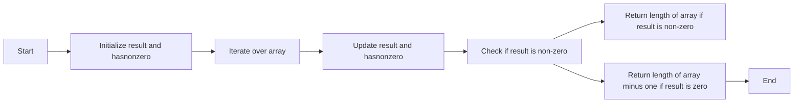

<h2><a href="https://leetcode.com/problems/longest-subsequence-with-non-zero-bitwise-xor">0000. Longest Subsequence With Non Zero Bitwise Xor</a></h2>

<p>You are given an integer array <code>nums</code>.</p>

<p>Return the length of the <strong>longest <span data-keyword="subsequence-array-nonempty" class=" cursor-pointer relative text-dark-blue-s text-sm"><button type="button" aria-haspopup="dialog" aria-expanded="false" aria-controls="radix-_r_s_" data-state="closed" class="">subsequence</button></span></strong> in <code>nums</code> whose bitwise <strong>XOR</strong> is <strong>non-zero</strong>. If no such <strong>subsequence</strong> exists, return 0.</p>

<p>&nbsp;</p>
<p><strong class="example">Example 1:</strong></p>

<div class="example-block">
<p><strong>Input:</strong> <span class="example-io">nums = [1,2,3]</span></p>

<p><strong>Output:</strong> <span class="example-io">2</span></p>

<p><strong>Explanation:</strong></p>

<p>One longest subsequence is <code>[2, 3]</code>. The bitwise XOR is computed as <code>2 XOR 3 = 1</code>, which is non-zero.</p>
</div>

<p><strong class="example">Example 2:</strong></p>

<div class="example-block">
<p><strong>Input:</strong> <span class="example-io">nums = [2,3,4]</span></p>

<p><strong>Output:</strong> <span class="example-io">3</span></p>

<p><strong>Explanation:</strong></p>

<p>The longest subsequence is <code>[2, 3, 4]</code>. The bitwise XOR is computed as <code>2 XOR 3 XOR 4 = 5</code>, which is non-zero.</p>
</div>

<p>&nbsp;</p>
<p><strong>Constraints:</strong></p>

<ul>
	<li><code>1 &lt;= nums.length &lt;= 10<sup>5</sup></code></li>
	<li><code>0 &lt;= nums[i] &lt;= 10<sup>9</sup></code></li>
</ul>


---

# 🛍️ Longest-Subsequence-With-Non-Zero-Bitwise-Xor | Explained

## Approach 1: Bitwise XOR Accumulation
### Intuition
This approach works by accumulating the bitwise XOR of all elements in the input array. The core idea is that if the final result is non-zero, it means that there exists at least one non-zero element in the array, and therefore the longest subsequence with non-zero bitwise XOR is the entire array itself. On the other hand, if the final result is zero, it means that the array can be divided into two subsequences with zero bitwise XOR, and the longest subsequence with non-zero bitwise XOR is the array minus one element.

### Algorithm Visualized


### Approach
The algorithm starts by initializing two variables: `result` to store the cumulative bitwise XOR of the array elements, and `hasnonzero` to track whether at least one non-zero element has been encountered. It then iterates over the array, updating `result` and `hasnonzero` accordingly. Finally, it checks the value of `result` and returns the length of the array or the length of the array minus one, depending on whether `result` is non-zero or zero.

### Detailed Code Analysis
The code initializes `result` to 0 and `hasnonzero` to `false`. It then enters a loop that iterates over the array, where for each element `nums[i]`, it updates `result` by performing a bitwise XOR operation with `nums[i]`. It also checks if `nums[i]` is non-zero and updates `hasnonzero` accordingly. After the loop, it checks the value of `result` and returns the length of the array if `result` is non-zero, or the length of the array minus one if `result` is zero.

### Code
```java
class Solution {
    public int longestSubsequence(int[] nums) {
        int result = 0;
        boolean hasnonzero = false;
        for (int i = 0; i < nums.length; i++) {
            result ^= nums[i];
            if (nums[i] != 0) {
                hasnonzero = true;
            }
        }
        if (!hasnonzero) {
            return 0;
        }
        if (result > 0) {
            return nums.length;
        } else {
            return nums.length - 1;
        }
    }
}
```

### Complexity
- **Time:** The algorithm has a time complexity of O(n), where n is the length of the input array, because it iterates over the array once.
- **Space:** The algorithm has a space complexity of O(1), because it only uses a constant amount of space to store the `result` and `hasnonzero` variables, regardless of the size of the input array.

## 🕵️‍♂️ Follow-up Questions (Optional)
What if the input array is empty? In this case, the algorithm would return 0, which is correct because the longest subsequence with non-zero bitwise XOR of an empty array is indeed 0. Another follow-up question could be: what if the input array contains only zeros? In this case, the algorithm would return 0, which is correct because the longest subsequence with non-zero bitwise XOR of an array containing only zeros is indeed 0.