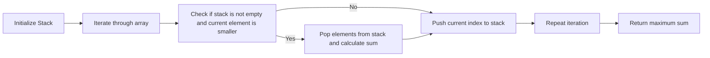

<h2><a href="https://leetcode.com/problems/maximum-subarray-min-product">0000. Maximum Subarray Min Product</a></h2>

<p>The <strong>min-product</strong> of an array is equal to the <strong>minimum value</strong> in the array <strong>multiplied by</strong> the array's <strong>sum</strong>.</p>

<ul>
	<li>For example, the array <code>[3,2,5]</code> (minimum value is <code>2</code>) has a min-product of <code>2 * (3+2+5) = 2 * 10 = 20</code>.</li>
</ul>

<p>Given an array of integers <code>nums</code>, return <em>the <strong>maximum min-product</strong> of any <strong>non-empty subarray</strong> of </em><code>nums</code>. Since the answer may be large, return it <strong>modulo</strong> <code>10<sup>9</sup> + 7</code>.</p>

<p>Note that the min-product should be maximized <strong>before</strong> performing the modulo operation. Testcases are generated such that the maximum min-product <strong>without</strong> modulo will fit in a <strong>64-bit signed integer</strong>.</p>

<p>A <strong>subarray</strong> is a <strong>contiguous</strong> part of an array.</p>

<p>&nbsp;</p>
<p><strong class="example">Example 1:</strong></p>

<pre><strong>Input:</strong> nums = [1,<u>2,3,2</u>]
<strong>Output:</strong> 14
<strong>Explanation:</strong> The maximum min-product is achieved with the subarray [2,3,2] (minimum value is 2).
2 * (2+3+2) = 2 * 7 = 14.
</pre>

<p><strong class="example">Example 2:</strong></p>

<pre><strong>Input:</strong> nums = [2,<u>3,3</u>,1,2]
<strong>Output:</strong> 18
<strong>Explanation:</strong> The maximum min-product is achieved with the subarray [3,3] (minimum value is 3).
3 * (3+3) = 3 * 6 = 18.
</pre>

<p><strong class="example">Example 3:</strong></p>

<pre><strong>Input:</strong> nums = [3,1,<u>5,6,4</u>,2]
<strong>Output:</strong> 60
<strong>Explanation:</strong> The maximum min-product is achieved with the subarray [5,6,4] (minimum value is 4).
4 * (5+6+4) = 4 * 15 = 60.
</pre>

<p>&nbsp;</p>
<p><strong>Constraints:</strong></p>

<ul>
	<li><code>1 &lt;= nums.length &lt;= 10<sup>5</sup></code></li>
	<li><code>1 &lt;= nums[i] &lt;= 10<sup>7</sup></code></li>
</ul>


---

# 🛍️ Maximum-Subarray-Min-Product | Explained

## Approach 1: Monotonic Stack Approach
### Intuition
The core idea behind this approach is to utilize a monotonic stack to efficiently find the maximum subarray min-product. The intuition is based on the concept of finding the next smaller element for each element in the array, which helps in calculating the sum of the subarray. By maintaining a monotonic stack, we can efficiently find the next smaller element and calculate the sum of the subarray in O(n) time complexity.

### Algorithm Visualized


### Approach
The approach involves iterating through the array and maintaining a monotonic stack. For each element, we check if the stack is not empty and the current element is smaller than the top element of the stack. If this condition is true, we pop elements from the stack and calculate the sum of the subarray. We then push the current index to the stack. We repeat this process until we have iterated through the entire array.

### Detailed Code Analysis
Let's dive into the code block and analyze it line by line.

```java
int len = nums.length;
int M = 1_000_000_007;
Deque<Integer> stack = new ArrayDeque<>();
long res = 0;
long[] preSum = new long[len + 1];
```

In the above code, we initialize the length of the array, a modulo value `M`, a deque stack, a result variable `res`, and a prefix sum array `preSum`.

```java
for (int i = 1; i <= len; i ++) {
    preSum[i] = preSum[i - 1] + nums[i - 1];
}
```

We then calculate the prefix sum of the array, which will help us in calculating the sum of the subarray in O(1) time complexity.

```java
for (int i = 0; i <= len; i ++) {
    while (!stack.isEmpty() && (i == len || nums[stack.getLast()] >= nums[i])) {
        int mid = stack.removeLast();
        int prevMin = stack.isEmpty() ?  -1 : stack.getLast();
        int nextMin = i;
        long sum = preSum[nextMin] - preSum[prevMin + 1];
        res = Math.max(res, sum * nums[mid]);
    }
    stack.addLast(i);
}
```

In the above code, we iterate through the array and maintain a monotonic stack. For each element, we check if the stack is not empty and the current element is smaller than the top element of the stack. If this condition is true, we pop elements from the stack and calculate the sum of the subarray. We then update the result variable `res` with the maximum sum.

```java
return (int)(res % 1_000_000_007);
```

Finally, we return the result modulo `M`.

### Code
```java
public int maxSumMinProduct(int[] nums) {
    int len = nums.length;
    int M = 1_000_000_007;
    Deque<Integer> stack = new ArrayDeque<>();
    long res = 0;
    long[] preSum = new long[len + 1];
    for (int i = 1; i <= len; i ++) {
        preSum[i] = preSum[i - 1] + nums[i - 1];
    }
    for (int i = 0; i <= len; i ++) {
        while (!stack.isEmpty() && (i == len || nums[stack.getLast()] >= nums[i])) {
            int mid = stack.removeLast();
            int prevMin = stack.isEmpty() ?  -1 : stack.getLast();
            int nextMin = i;
            long sum = preSum[nextMin] - preSum[prevMin + 1];
            res = Math.max(res, sum * nums[mid]);
        }
        stack.addLast(i);
    }
    return (int)(res % 1_000_000_007);
}
```

### Complexity
- **Time:** O(n), where n is the length of the array. This is because we iterate through the array once and perform a constant amount of work for each element.
- **Space:** O(n), where n is the length of the array. This is because we use a deque stack to store the indices of the elements, which can grow up to a size of n in the worst case. We also use a prefix sum array of size n+1.