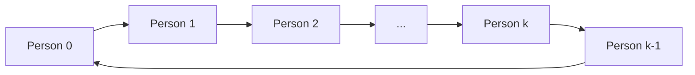

<h2><a href="https://leetcode.com/problems/time-needed-to-buy-tickets">2073. Time Needed to Buy Tickets</a></h2>

<p>There are <code>n</code> people in a line queuing to buy tickets, where the <code>0<sup>th</sup></code> person is at the <strong>front</strong> of the line and the <code>(n - 1)<sup>th</sup></code> person is at the <strong>back</strong> of the line.</p>

<p>You are given a <strong>0-indexed</strong> integer array <code>tickets</code> of length <code>n</code> where the number of tickets that the <code>i<sup>th</sup></code> person would like to buy is <code>tickets[i]</code>.</p>

<p>Each person takes <strong>exactly 1 second</strong> to buy a ticket. A person can only buy <strong>1 ticket at a time</strong> and has to go back to <strong>the end</strong> of the line (which happens <strong>instantaneously</strong>) in order to buy more tickets. If a person does not have any tickets left to buy, the person will <strong>leave </strong>the line.</p>

<p>Return the <strong>time taken</strong> for the person <strong>initially</strong> at position <strong>k</strong><strong> </strong>(0-indexed) to finish buying tickets.</p>

<p>&nbsp;</p>
<p><strong class="example">Example 1:</strong></p>

<div class="example-block">
<p><strong>Input:</strong> <span class="example-io">tickets = [2,3,2], k = 2</span></p>

<p><strong>Output:</strong> <span class="example-io">6</span></p>

<p><strong>Explanation:</strong></p>

<ul>
	<li>The queue starts as [2,3,<u>2</u>], where the kth person is underlined.</li>
	<li>After the person at the front has bought a ticket, the queue becomes [3,<u>2</u>,1] at 1 second.</li>
	<li>Continuing this process, the queue becomes [<u>2</u>,1,2] at 2 seconds.</li>
	<li>Continuing this process, the queue becomes [1,2,<u>1</u>] at 3 seconds.</li>
	<li>Continuing this process, the queue becomes [2,<u>1</u>] at 4 seconds. Note: the person at the front left the queue.</li>
	<li>Continuing this process, the queue becomes [<u>1</u>,1] at 5 seconds.</li>
	<li>Continuing this process, the queue becomes [1] at 6 seconds. The kth person has bought all their tickets, so return 6.</li>
</ul>
</div>

<p><strong class="example">Example 2:</strong></p>

<div class="example-block">
<p><strong>Input:</strong> <span class="example-io">tickets = [5,1,1,1], k = 0</span></p>

<p><strong>Output:</strong> <span class="example-io">8</span></p>

<p><strong>Explanation:</strong></p>

<ul>
	<li>The queue starts as [<u>5</u>,1,1,1], where the kth person is underlined.</li>
	<li>After the person at the front has bought a ticket, the queue becomes [1,1,1,<u>4</u>] at 1 second.</li>
	<li>Continuing this process for 3 seconds, the queue becomes [<u>4]</u> at 4 seconds.</li>
	<li>Continuing this process for 4 seconds, the queue becomes [] at 8 seconds. The kth person has bought all their tickets, so return 8.</li>
</ul>
</div>

<p>&nbsp;</p>
<p><strong>Constraints:</strong></p>

<ul>
	<li><code>n == tickets.length</code></li>
	<li><code>1 &lt;= n &lt;= 100</code></li>
	<li><code>1 &lt;= tickets[i] &lt;= 100</code></li>
	<li><code>0 &lt;= k &lt; n</code></li>
</ul>


---

# 🛍️ Time-Needed-to-Buy-Tickets | Explained

## Approach 1: Simulated Queue
### Intuition
The core idea behind this approach is to simulate the process of buying tickets in a queue. Imagine people standing in a line, each representing a ticket. When it's their turn, they buy one ticket and move to the end of the line. The process continues until the person at index `k` has bought all their tickets. This approach works because it accurately models the real-world scenario of people buying tickets in a queue.

### Algorithm Visualized

### Approach
The algorithm starts by initializing a variable `time` to keep track of the total time taken. It then enters a loop that continues until the person at index `k` has bought all their tickets. In each iteration of the loop, the algorithm simulates the process of buying tickets by iterating over the queue and decrementing the ticket count for each person. If the person has tickets left, the `time` is incremented. The loop continues until the person at index `k` has no more tickets left.

### Detailed Code Analysis
The code starts by initializing the `n` variable to store the length of the `tickets` array. The `time` variable is initialized to keep track of the total time taken. The `while` loop checks if the person at index `k` has any tickets left. If they do, the loop continues.

 Inside the loop, the code iterates over the `tickets` array using a `for` loop. For each person, it checks if they have any tickets left. If they do, it decrements the ticket count and increments the `time`. If the person is the one at index `k` and they have no more tickets left, the function returns the `time`.

The `tickets` array is used to keep track of the number of tickets each person has. The `k` variable is used to keep track of the index of the person we are interested in.

### Code
```python
class Solution:
    def timeRequiredToBuy(self, tickets: List[int], k: int) -> int:
        n = len(tickets)
        time = 0
        
        # Simulate the process
        while tickets[k] > 0:
            for i in range(n):
                if tickets[i] > 0:
                    tickets[i] -= 1
                    time += 1
                    if i == k and tickets[i] == 0:
                        return time
        return time
```
### Complexity
- **Time:** O(n * max(tickets)), where n is the number of people in the queue and max(tickets) is the maximum number of tickets any person has. This is because in the worst-case scenario, we need to simulate the process for each person in the queue for the maximum number of tickets.
- **Space:** O(1), because we only use a constant amount of space to store the `time` and `n` variables, regardless of the input size. The input `tickets` array is not included in the space complexity because it is part of the input, not the algorithm's working space. 

## 🕵️‍♂️ Follow-up Questions (Optional)
What if the queue is not a simple array, but a linked list? How would you modify the algorithm to work with a linked list? 

Answer: You would need to modify the algorithm to traverse the linked list instead of the array. You would also need to keep track of the current node in the linked list, and update it accordingly.

What if the person at index `k` is not the only person who can buy tickets? How would you modify the algorithm to work with multiple people buying tickets? 

Answer: You would need to modify the algorithm to keep track of the number of tickets each person has, and update it accordingly. You would also need to modify the condition in the `while` loop to check if any person has tickets left, not just the person at index `k`.