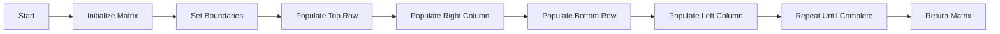

<h2><a href="https://leetcode.com/problems/spiral-matrix-iv">2326. Spiral Matrix IV</a></h2>

<p>You are given two integers <code>m</code> and <code>n</code>, which represent the dimensions of a matrix.</p>

<p>You are also given the <code>head</code> of a linked list of integers.</p>

<p>Generate an <code>m x n</code> matrix that contains the integers in the linked list presented in <strong>spiral</strong> order <strong>(clockwise)</strong>, starting from the <strong>top-left</strong> of the matrix. If there are remaining empty spaces, fill them with <code>-1</code>.</p>

<p>Return <em>the generated matrix</em>.</p>

<p>&nbsp;</p>
<p><strong class="example">Example 1:</strong></p>

<pre><strong>Input:</strong> m = 3, n = 5, head = [3,0,2,6,8,1,7,9,4,2,5,5,0]
<strong>Output:</strong> [[3,0,2,6,8],[5,0,-1,-1,1],[5,2,4,9,7]]
<strong>Explanation:</strong> The diagram above shows how the values are printed in the matrix.
Note that the remaining spaces in the matrix are filled with -1.
</pre>

<p><strong class="example">Example 2:</strong></p>

<pre><strong>Input:</strong> m = 1, n = 4, head = [0,1,2]
<strong>Output:</strong> [[0,1,2,-1]]
<strong>Explanation:</strong> The diagram above shows how the values are printed from left to right in the matrix.
The last space in the matrix is set to -1.</pre>

<p>&nbsp;</p>
<p><strong>Constraints:</strong></p>

<ul>
	<li><code>1 &lt;= m, n &lt;= 10<sup>5</sup></code></li>
	<li><code>1 &lt;= m * n &lt;= 10<sup>5</sup></code></li>
	<li>The number of nodes in the list is in the range <code>[1, m * n]</code>.</li>
	<li><code>0 &lt;= Node.val &lt;= 1000</code></li>
</ul>


---

# 🛍️ Spiral-Matrix-IV | Explained

## Approach 1: Spiral Matrix Construction
### Intuition
This approach works by constructing a 2D array (matrix) row by row, starting from the top row and moving clockwise in a spiral direction. It uses the values from a singly-linked list to populate the matrix. The intuition behind this approach is similar to how we might fill a container with liquid in a spiral pattern, starting from the outermost point and moving inwards.

### Algorithm Visualized

### Approach
1. Initialize a 2D array (matrix) with dimensions `m x n`.
2. Set the boundaries of the matrix to keep track of the current top, bottom, left, and right edges.
3. Populate the top row of the matrix with values from the linked list, moving from left to right.
4. Populate the right column of the matrix with values from the linked list, moving from top to bottom.
5. Populate the bottom row of the matrix with values from the linked list, moving from right to left.
6. Populate the left column of the matrix with values from the linked list, moving from bottom to top.
7. Repeat steps 3-6 until the entire matrix is populated or the linked list is exhausted.

### Detailed Code Analysis
The code starts by initializing a 2D array `array` with dimensions `m x n` and filling it with -1 to represent empty cells.
```java
int[][] array = new int[m][n];
for(int[] row : array){
    Arrays.fill(row,-1);
}
```
The boundaries of the matrix are then set to keep track of the current top, bottom, left, and right edges.
```java
int top=0;
int bottom = m-1;
int left=0;
int right = n-1;
```
The code then enters a loop that continues until the entire matrix is populated or the linked list is exhausted.
```java
while(top<=bottom && left<=right && head!=null){
    // ...
}
```
 Inside the loop, the code populates the top row of the matrix with values from the linked list, moving from left to right.
```java
for(int i=left;i<=right && head!=null;i++){
    array[top][i] = head.val;
    head=head.next;
}
top++;
```
The code then populates the right column of the matrix with values from the linked list, moving from top to bottom.
```java
for(int i=top;i<=bottom && head!=null;i++){
    array[i][right]=head.val;
    head=head.next;
}
right--;
```
The code then populates the bottom row of the matrix with values from the linked list, moving from right to left, and the left column, moving from bottom to top.
```java
if(top<=bottom){
    for(int i=right;i>=left && head!=null;i--){
        array[bottom][i]=head.val;
        head=head.next;
    }
    bottom--;
}
if(left<=right){
    for(int i=bottom;i>=top && head!=null;i--){
        array[i][left]=head.val;
        head=head.next;
    }
    left++;
}
```
### Code
```java
public int[][] spiralMatrix(int m, int n, ListNode head) {
    int[][] array = new int[m][n];
    for(int[] row : array){
        Arrays.fill(row,-1);
    }
    int top=0;
    int bottom = m-1;
    int left=0;
    int right = n-1;
    while(top<=bottom && left<=right && head!=null){
        for(int i=left;i<=right && head!=null;i++){
            array[top][i] = head.val;
            head=head.next;
        }
        top++;
        for(int i=top;i<=bottom && head!=null;i++){
            array[i][right]=head.val;
            head=head.next;
        }
        right--;
        if(top<=bottom){
            for(int i=right;i>=left && head!=null;i--){
                array[bottom][i]=head.val;
                head=head.next;
            }
            bottom--;
        }
        if(left<=right){
            for(int i=bottom;i>=top && head!=null;i--){
                array[i][left]=head.val;
                head=head.next;
            }
            left++;
        }
    }
    return array;
}
```
### Complexity
- **Time:** O(m * n) where m and n are the dimensions of the matrix. This is because in the worst case, we need to populate every cell in the matrix.
- **Space:** O(m * n) where m and n are the dimensions of the matrix. This is because we need to store the entire matrix in memory.

## 🕵️‍♂️ Follow-up Questions (Optional)
1. How would you optimize the solution if the linked list is very large and the matrix is very small?
 Answer: You can optimize the solution by checking if the linked list is exhausted after each iteration of the loop, and if so, break out of the loop early.
2. How would you handle the case where the matrix is not a perfect square?
 Answer: The solution already handles the case where the matrix is not a perfect square. The loop conditions are set up to ensure that we don't try to access indices outside the bounds of the matrix.