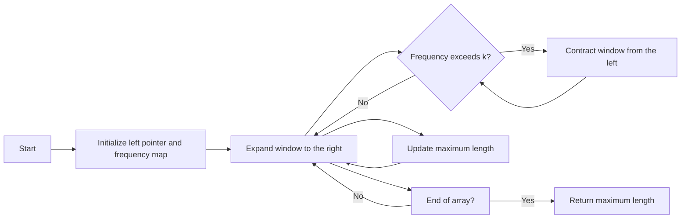

<h2><a href="https://leetcode.com/problems/length-of-longest-subarray-with-at-most-k-frequency">2958. Length of Longest Subarray With at Most K Frequency</a></h2>

<p>You are given an integer array <code>nums</code> and an integer <code>k</code>.</p>

<p>The <strong>frequency</strong> of an element <code>x</code> is the number of times it occurs in an array.</p>

<p>An array is called <strong>good</strong> if the frequency of each element in this array is <strong>less than or equal</strong> to <code>k</code>.</p>

<p>Return <em>the length of the <strong>longest</strong> <strong>good</strong> subarray of</em> <code>nums</code><em>.</em></p>

<p>A <strong>subarray</strong> is a contiguous non-empty sequence of elements within an array.</p>

<p>&nbsp;</p>
<p><strong class="example">Example 1:</strong></p>

<pre><strong>Input:</strong> nums = [1,2,3,1,2,3,1,2], k = 2
<strong>Output:</strong> 6
<strong>Explanation:</strong> The longest possible good subarray is [1,2,3,1,2,3] since the values 1, 2, and 3 occur at most twice in this subarray. Note that the subarrays [2,3,1,2,3,1] and [3,1,2,3,1,2] are also good.
It can be shown that there are no good subarrays with length more than 6.
</pre>

<p><strong class="example">Example 2:</strong></p>

<pre><strong>Input:</strong> nums = [1,2,1,2,1,2,1,2], k = 1
<strong>Output:</strong> 2
<strong>Explanation:</strong> The longest possible good subarray is [1,2] since the values 1 and 2 occur at most once in this subarray. Note that the subarray [2,1] is also good.
It can be shown that there are no good subarrays with length more than 2.
</pre>

<p><strong class="example">Example 3:</strong></p>

<pre><strong>Input:</strong> nums = [5,5,5,5,5,5,5], k = 4
<strong>Output:</strong> 4
<strong>Explanation:</strong> The longest possible good subarray is [5,5,5,5] since the value 5 occurs 4 times in this subarray.
It can be shown that there are no good subarrays with length more than 4.
</pre>

<p>&nbsp;</p>
<p><strong>Constraints:</strong></p>

<ul>
	<li><code>1 &lt;= nums.length &lt;= 10<sup>5</sup></code></li>
	<li><code>1 &lt;= nums[i] &lt;= 10<sup>9</sup></code></li>
	<li><code>1 &lt;= k &lt;= nums.length</code></li>
</ul>


---

# 🛍️ Length-of-Longest-Subarray-With-at-Most-K-Frequency | Explained

## Approach 1: Sliding Window with Frequency Map
### Intuition
The intuition behind this approach is to utilize a sliding window technique in conjunction with a frequency map to track the occurrences of each number within the current window. This method works because it allows us to efficiently expand and contract the window based on the frequency constraint, effectively finding the longest subarray that meets the condition. Think of it like a dynamic filter that adjusts its width as it scans through the array, ensuring that the frequency of any number within the filtered section does not exceed the specified limit.

### Algorithm Visualized


### Approach
The algorithm starts by initializing a left pointer and a frequency map. It then enters a loop where it continually expands the window to the right, updating the frequency map as it goes. If at any point the frequency of any number exceeds `k`, it contracts the window from the left until the frequency condition is met again. The maximum length of the subarray seen so far is updated during this process.

### Detailed Code Analysis
Looking at the provided code snippet, the key elements are the use of a `HashMap` named `map` to store the frequency of each number and the two pointers, `left` and `right`, representing the sliding window. The line `map.put(nums[left], map.get(nums[left]) - 1);` is crucial for contracting the window when the frequency condition is violated, as it decreases the count of the number at the `left` index, effectively moving the `left` pointer to the right. The `while` loop `while (map.get(nums[right]) > k)` seems to be incorrectly placed in the provided snippet, as it should be part of the logic to adjust the window based on the frequency condition. However, the general structure suggests an intent to maintain a sliding window that adheres to the frequency constraint.

The choice of a `HashMap` for storing frequencies is efficient because it allows for constant time complexity for both getting and putting elements, which is essential for the performance of the sliding window technique.

### Code
```java
public int maxSubarrayLength(int[] nums, int k) {
    HashMap<Integer, Integer> map = new HashMap<>();
    int max = 0;
    int left = 0;
    for (int right = 0; right < nums.length; right++) {
        map.put(nums[right], map.getOrDefault(nums[right], 0) + 1);
        while (map.get(nums[right]) > k) {
            map.put(nums[left], map.get(nums[left]) - 1);
            if (map.get(nums[left]) == 0) {
                map.remove(nums[left]);
            }
            left++;
        }
        max = Math.max(max, right - left + 1);
    }
    return max;
}
```

### Complexity
- **Time:** O(n), where n is the length of the input array. This is because each element is visited at most twice (once by the `right` pointer and once by the `left` pointer).
- **Space:** O(n), as in the worst-case scenario (all unique elements), the size of the frequency map can grow up to the size of the input array.

## 🕵️‍♂️ Follow-up Questions (Optional)
1. How would you modify the solution if the constraint was on the total sum of the subarray instead of frequency?
   - You would use a similar sliding window approach but update the sum instead of frequency, adjusting the window when the sum exceeds a certain threshold.
2. What if the array can contain negative numbers or zeros, and we still want to maintain a frequency constraint?
   - The solution provided already handles this scenario since it uses a frequency map that can store counts for any integer value, including negatives and zero.