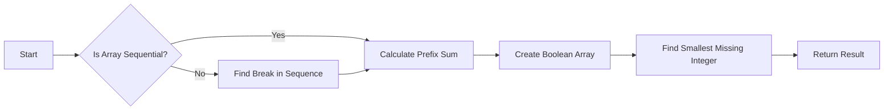

<h2><a href="https://leetcode.com/problems/smallest-missing-integer-greater-than-sequential-prefix-sum">2996. Smallest Missing Integer Greater Than Sequential Prefix Sum</a></h2>

<p>You are given a <strong>0-indexed</strong> array of integers <code>nums</code>.</p>

<p>A prefix <code>nums[0..i]</code> is <strong>sequential</strong> if, for all <code>1 &lt;= j &lt;= i</code>, <code>nums[j] = nums[j - 1] + 1</code>. In particular, the prefix consisting only of <code>nums[0]</code> is <strong>sequential</strong>.</p>

<p>Return <em>the <strong>smallest</strong> integer</em> <code>x</code> <em>missing from</em> <code>nums</code> <em>such that</em> <code>x</code> <em>is greater than or equal to the sum of the <strong>longest</strong> sequential prefix.</em></p>

<p>&nbsp;</p>
<p><strong class="example">Example 1:</strong></p>

<pre><strong>Input:</strong> nums = [1,2,3,2,5]
<strong>Output:</strong> 6
<strong>Explanation:</strong> The longest sequential prefix of nums is [1,2,3] with a sum of 6. 6 is not in the array, therefore 6 is the smallest missing integer greater than or equal to the sum of the longest sequential prefix.
</pre>

<p><strong class="example">Example 2:</strong></p>

<pre><strong>Input:</strong> nums = [3,4,5,1,12,14,13]
<strong>Output:</strong> 15
<strong>Explanation:</strong> The longest sequential prefix of nums is [3,4,5] with a sum of 12. 12, 13, and 14 belong to the array while 15 does not. Therefore 15 is the smallest missing integer greater than or equal to the sum of the longest sequential prefix.
</pre>

<p>&nbsp;</p>
<p><strong>Constraints:</strong></p>

<ul>
	<li><code>1 &lt;= nums.length &lt;= 50</code></li>
	<li><code>1 &lt;= nums[i] &lt;= 50</code></li>
</ul>


---

# 🛍️ Smallest-Missing-Integer-Greater-Than-Sequential-Prefix-Sum | Explained

## Approach 1: Sequential Prefix Sum and Boolean Array
### Intuition
The core idea behind this approach is to first identify the sequential prefix sum of the given array and then find the smallest missing integer greater than this sum. The intuition works by initially checking if the array elements are sequential. If a break in the sequence is found, the prefix sum is calculated up to that point. Then, a boolean array is used to mark the presence of each number in the array. Finally, starting from the prefix sum, the code increments until it finds a missing integer. This approach can be likened to finding a gap in a set of numbered boxes where each box represents an integer.

### Algorithm Visualized


### Approach
The high-level logic flow involves checking the array for sequential elements, calculating a prefix sum, creating a boolean array to track the presence of each number, and then finding the smallest missing integer greater than the prefix sum.

### Detailed Code Analysis
The code begins by initializing variables: `result` (not used but presumably intended for the final answer), `commpref` (to track the index where the sequence breaks), and `sum` (initialized with the first element of the array). It then iterates through the array to check for sequential elements. If a break in the sequence is found (`nums[i] != nums[i-1] + 1`), it updates `commpref` and breaks the loop. Otherwise, it adds the current element to `sum`.

After the loop, a boolean array `array` of size 51 is created, and the code marks the presence of each number in the array by setting the corresponding index in `array` to `true`.

Finally, the code enters a loop starting from `sum`, incrementing by 1 until it finds a missing integer (i.e., an index in `array` that is `false`). This missing integer is then returned as the result.

### Code
```java
int result = 0;
int commpref = nums.length - 1;
int sum = nums[0];
for (int i = 1; i < nums.length; i++) {
    if (nums[i] != nums[i - 1] + 1) {
        commpref = i - 1;
        break;
    } else {
        sum += nums[i];
    }
}
boolean[] array = new boolean[51];
for (int i = 0; i < nums.length; i++) {
    array[nums[i]] = true;
}
while (sum <= 50 && array[sum]) {
    sum++;
}
return sum;
```

### Complexity
- **Time:** The time complexity of this solution is O(n + m), where n is the number of elements in the input array and m is the size of the boolean array (in this case, 51). The first loop through the input array takes O(n) time, and the second loop to mark the boolean array takes O(n) time as well. The final while loop, in the worst case, could iterate up to m times. However, since m is a constant (51), the overall time complexity is linear with respect to n.
- **Space:** The space complexity is O(n + m), primarily due to the boolean array of size 51. The input array requires O(n) space, but this is not typically counted in the space complexity since it is part of the input, not additional space used by the algorithm. The additional variables used require constant space, O(1). Thus, the dominant space usage comes from the boolean array, making the space complexity O(n + m), which simplifies to O(n) since m is a constant.