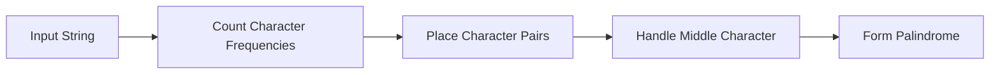

<h2><a href="https://leetcode.com/problems/smallest-palindromic-rearrangement-i">3517. Smallest Palindromic Rearrangement I</a></h2>

<p>You are given a <strong><span data-keyword="palindrome-string" class=" cursor-pointer relative text-dark-blue-s text-sm"><button type="button" aria-haspopup="dialog" aria-expanded="false" aria-controls="radix-_r_23_" data-state="closed" class="">palindromic</button></span></strong> string <code>s</code>.</p>

<p>Return the <strong><span data-keyword="lexicographically-smaller-string" class=" cursor-pointer relative text-dark-blue-s text-sm"><button type="button" aria-haspopup="dialog" aria-expanded="false" aria-controls="radix-_r_24_" data-state="closed" class="">lexicographically smallest</button></span></strong> palindromic <span data-keyword="permutation-string" class=" cursor-pointer relative text-dark-blue-s text-sm"><button type="button" aria-haspopup="dialog" aria-expanded="false" aria-controls="radix-_r_25_" data-state="closed" class="">permutation</button></span> of <code>s</code>.</p>

<p>&nbsp;</p>
<p><strong class="example">Example 1:</strong></p>

<div class="example-block">
<p><strong>Input:</strong> <span class="example-io">s = "z"</span></p>

<p><strong>Output:</strong> <span class="example-io">"z"</span></p>

<p><strong>Explanation:</strong></p>

<p>A string of only one character is already the lexicographically smallest palindrome.</p>
</div>

<p><strong class="example">Example 2:</strong></p>

<div class="example-block">
<p><strong>Input:</strong> <span class="example-io">s = "babab"</span></p>

<p><strong>Output:</strong> <span class="example-io">"abbba"</span></p>

<p><strong>Explanation:</strong></p>

<p>Rearranging <code>"babab"</code> → <code>"abbba"</code> gives the smallest lexicographic palindrome.</p>
</div>

<p><strong class="example">Example 3:</strong></p>

<div class="example-block">
<p><strong>Input:</strong> <span class="example-io">s = "daccad"</span></p>

<p><strong>Output:</strong> <span class="example-io">"acddca"</span></p>

<p><strong>Explanation:</strong></p>

<p>Rearranging <code>"daccad"</code> → <code>"acddca"</code> gives the smallest lexicographic palindrome.</p>
</div>

<p>&nbsp;</p>
<p><strong>Constraints:</strong></p>

<ul>
	<li><code>1 &lt;= s.length &lt;= 10<sup>5</sup></code></li>
	<li><code>s</code> consists of lowercase English letters.</li>
	<li><code>s</code> is guaranteed to be palindromic.</li>
</ul>


---

# 🛍️ Smallest-Palindromic-Rearrangement-I | Explained

## Approach 1: Frequency-Based Palindromic Rearrangement
### Intuition
The core idea behind this approach is to understand that a palindrome can be formed by placing characters in a symmetrical manner. This approach works by first counting the frequency of each character in the string, then using this frequency information to place characters in pairs, and finally handling the case where there is a middle character that doesn't have a pair.

### Algorithm Visualized


### Approach
The algorithm starts by counting the frequency of each character in the input string. Then, it iterates through the frequency array and places each character in pairs at the start and end of the result string. If a character has an odd frequency, it means there will be one character left that can be placed in the middle of the palindrome.

### Detailed Code Analysis
Let's dive into the code:
- The code starts by initializing an array `freq` of size 26 to count the frequency of each character in the string. It iterates over the input string `s`, and for each character, it increments the corresponding index in the `freq` array (`freq[ch - 'a']++`).
- It then initializes a character array `ans` of the same length as the input string `s`. Two pointers, `left` and `right`, are used to keep track of the current positions at the start and end of the `ans` array.
- The code then places character pairs in the `ans` array. It iterates over the `freq` array, and for each character, it checks if the frequency is greater than or equal to 2. If it is, it places the character at the current `left` and `right` positions and increments `left` and decrements `right`. The frequency of the character is then reduced by 2.
- After placing all character pairs, the code handles the case where there is a middle character. It iterates over the `freq` array again, and if it finds a character with a frequency of 1, it places that character at the current `left` position (which would be the middle of the palindrome).

### Code
```java
int n = s.length();
int[] freq = new int[26];
for(char ch:s.toCharArray()) {
    freq[ch - 'a']++;
}

char[] ans = new char[n];
int left = 0;
int right = n-1;

for(int i=0; i < 26; i++) {
    while(freq[i] >= 2) {
        char ch = (char)('a' + i);
        ans[left++] = ch;
        ans[right--] = ch;
        freq[i] -= 2;
    }
}

for(int i=0; i < 26; i++) {
    if(freq[i] == 1) {
        ans[left] = (char)('a' + i);
        break;
    }
}

return new String(ans);
```

### Complexity
- **Time:** The time complexity of this algorithm is O(n + 26), where n is the length of the input string. This is because we iterate over the input string once to count the frequency of characters, and then we iterate over the frequency array to place characters in pairs and handle the middle character. Since the size of the frequency array is constant (26), the time complexity simplifies to O(n).
- **Space:** The space complexity of this algorithm is O(n), as we need to store the result string and the frequency array. The size of the frequency array is constant, but the size of the result string is proportional to the input size, so the overall space complexity is O(n).