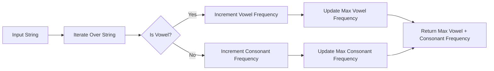

<h2><a href="https://leetcode.com/problems/find-most-frequent-vowel-and-consonant">3541. Find Most Frequent Vowel and Consonant</a></h2>

<p>You are given a string <code>s</code> consisting of lowercase English letters (<code>'a'</code> to <code>'z'</code>). </p>

<p>Your task is to:</p>

<ul>
	<li>Find the vowel (one of <code>'a'</code>, <code>'e'</code>, <code>'i'</code>, <code>'o'</code>, or <code>'u'</code>) with the <strong>maximum</strong> frequency.</li>
	<li>Find the consonant (all other letters excluding vowels) with the <strong>maximum</strong> frequency.</li>
</ul>

<p>Return the sum of the two frequencies.</p>

<p><strong>Note</strong>: If multiple vowels or consonants have the same maximum frequency, you may choose any one of them. If there are no vowels or no consonants in the string, consider their frequency as 0.</p>
The <strong>frequency</strong> of a letter <code>x</code> is the number of times it occurs in the string.
<p>&nbsp;</p>
<p><strong class="example">Example 1:</strong></p>

<div class="example-block">
<p><strong>Input:</strong> <span class="example-io">s = "successes"</span></p>

<p><strong>Output:</strong> <span class="example-io">6</span></p>

<p><strong>Explanation:</strong></p>

<ul>
	<li>The vowels are: <code>'u'</code> (frequency 1), <code>'e'</code> (frequency 2). The maximum frequency is 2.</li>
	<li>The consonants are: <code>'s'</code> (frequency 4), <code>'c'</code> (frequency 2). The maximum frequency is 4.</li>
	<li>The output is <code>2 + 4 = 6</code>.</li>
</ul>
</div>

<p><strong class="example">Example 2:</strong></p>

<div class="example-block">
<p><strong>Input:</strong> <span class="example-io">s = "aeiaeia"</span></p>

<p><strong>Output:</strong> <span class="example-io">3</span></p>

<p><strong>Explanation:</strong></p>

<ul>
	<li>The vowels are: <code>'a'</code> (frequency 3), <code>'e'</code> ( frequency 2), <code>'i'</code> (frequency 2). The maximum frequency is 3.</li>
	<li>There are no consonants in <code>s</code>. Hence, maximum consonant frequency = 0.</li>
	<li>The output is <code>3 + 0 = 3</code>.</li>
</ul>
</div>

<p>&nbsp;</p>
<p><strong>Constraints:</strong></p>

<ul>
	<li><code>1 &lt;= s.length &lt;= 100</code></li>
	<li><code>s</code> consists of lowercase English letters only.</li>
</ul>


---

# 🛍️ Find-Most-Frequent-Vowel-and-Consonant | Explained

## Approach 1: Frequency Counting
### Intuition
This approach works by iterating over the input string and for each character, it checks if the character is a vowel or a consonant. If it's a vowel, it increments the frequency count of that vowel in a frequency array and keeps track of the maximum frequency of vowels encountered so far. Similarly, if it's a consonant, it increments the frequency count of that consonant and keeps track of the maximum frequency of consonants encountered so far. The intuition behind this approach is to count the frequency of each character in the string and then find the maximum frequency of vowels and consonants.

### Algorithm Visualized


### Approach
The approach involves iterating over the input string, checking each character to determine if it's a vowel or a consonant, and updating the frequency counts and maximum frequencies accordingly.

### Detailed Code Analysis
The code starts by initializing an array `freq` of size 26 to store the frequency of each lowercase English letter. It also initializes two variables, `vowel` and `consonant`, to keep track of the maximum frequency of vowels and consonants encountered so far.

The code then iterates over the input string using a for loop. For each character, it checks if the character is a vowel by comparing it with the vowels 'a', 'e', 'i', 'o', and 'u'. If it's a vowel, it increments the corresponding index in the `freq` array and updates the `vowel` variable with the maximum frequency encountered so far.

If the character is not a vowel, it's considered a consonant, and the code increments the corresponding index in the `freq` array and updates the `consonant` variable with the maximum frequency encountered so far.

Finally, the code calculates the sum of the maximum frequencies of vowels and consonants and returns it.

### Code
```java
class Solution {
    public int maxFreqSum(String s) {
        int freq[] = new int[26];
        int vowel = 0;
        int consonant = 0;
        for (int i = 0; i < s.length(); i++) {
            char ch = s.charAt(i);
            if (ch == 'a' || ch == 'e' || ch == 'i' || ch == 'o' || ch == 'u') {
                freq[ch - 'a']++;
                vowel = Math.max(vowel, freq[ch - 'a']);
            } else {
                freq[ch - 'a']++;
                consonant = Math.max(consonant, freq[ch - 'a']);
            }
        }
        int total = vowel + consonant;
        return total;
    }
}
```

### Complexity
- **Time:** O(n), where n is the length of the input string, since we're iterating over the string once.
- **Space:** O(1), since we're using a fixed-size array of size 26 to store the frequency of each character, regardless of the input size.

## 🕵️‍♂️ Follow-up Questions (Optional)
1. What if the input string contains uppercase letters or non-alphabetic characters? 
Answer: The current implementation assumes the input string only contains lowercase letters. To handle uppercase letters or non-alphabetic characters, we would need to modify the code to handle these cases, such as by converting uppercase letters to lowercase or ignoring non-alphabetic characters.
2. How would you optimize the code to handle very large input strings? 
Answer: The current implementation has a time complexity of O(n), which is already optimal for this problem. However, to further optimize the code, we could consider using a more efficient data structure, such as a `HashMap`, to store the frequency of each character, especially if the input string contains a large number of unique characters.