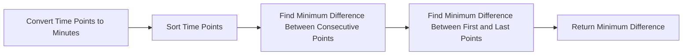

<h2><a href="https://leetcode.com/problems/minimum-time-difference">539. Minimum Time Difference</a></h2>

Given a list of 24-hour clock time points in <strong>"HH:MM"</strong> format, return <em>the minimum <b>minutes</b> difference between any two time-points in the list</em>.
<p>&nbsp;</p>
<p><strong class="example">Example 1:</strong></p>
<pre><strong>Input:</strong> timePoints = ["23:59","00:00"]
<strong>Output:</strong> 1
</pre><p><strong class="example">Example 2:</strong></p>
<pre><strong>Input:</strong> timePoints = ["00:00","23:59","00:00"]
<strong>Output:</strong> 0
</pre>
<p>&nbsp;</p>
<p><strong>Constraints:</strong></p>

<ul>
	<li><code>2 &lt;= timePoints.length &lt;= 2 * 10<sup>4</sup></code></li>
	<li><code>timePoints[i]</code> is in the format <strong>"HH:MM"</strong>.</li>
</ul>


---

# 🛍️ Minimum-Time-Difference | Explained

## Approach 1: Sorting and Iterative Comparison
### Intuition
This approach works by first converting all time points to a common unit (minutes) and sorting them. Then, it iterates through the sorted list to find the minimum difference between any two consecutive time points. The key intuition here is that the minimum difference will either be between two adjacent time points or between the first and last time points (to account for the circular nature of time). This approach is efficient because it leverages the fact that the minimum difference must be between two points that are close to each other in the sorted list.

### Algorithm Visualized


### Approach
1. Convert all time points from the format "HH:MM" to minutes since 00:00.
2. Sort the list of time points in ascending order.
3. Initialize a variable to store the minimum difference found so far, starting with the maximum possible value.
4. Iterate through the sorted list of time points, calculating the difference between each pair of consecutive points and updating the minimum difference if a smaller one is found.
5. After iterating through all points, calculate the difference between the first and last points (to account for the circular nature of time) and update the minimum difference if necessary.

### Detailed Code Analysis
The code starts by initializing an empty list `vec` to store the time points converted to minutes. It then iterates through each time point in the input list `timePoints`. For each time point, it extracts the hours and minutes using `substring` and converts them to an integer representation of minutes since 00:00. This is done by multiplying the hours by 60 (since there are 60 minutes in an hour) and adding the minutes. The result is added to the `vec` list.

After converting all time points to minutes and storing them in `vec`, the list is sorted in ascending order using `Collections.sort(vec)`. This step is crucial for efficiently finding the minimum difference.

The code then initializes a variable `res` to `Integer.MAX_VALUE`, which will be used to store the minimum difference found. It iterates through the sorted list `vec`, starting from the second element (index 1), and calculates the difference between each element and its previous one. If the calculated difference is less than the current `res`, it updates `res`.

Finally, to handle the circular case (where the minimum difference might be between the first and last time points), it calculates this difference by subtracting the last time point from the first one and adding 1440 (the total number of minutes in a day) to ensure a positive result. If this difference is less than the current `res`, it updates `res` before returning it as the minimum difference.

### Code
```java
class Solution {
    public int findMinDifference(List<String> timePoints) {
        // Step 1: Convert all time points to minutes and store in a list
        List<Integer> vec = new ArrayList<>();
        for (String timePoint : timePoints) {
            int h = Integer.parseInt(timePoint.substring(0, 2));
            int m = Integer.parseInt(timePoint.substring(3));
            int mins = h * 60 + m;
            vec.add(mins);
        }
        
        // Step 2: Sort the time points
        Collections.sort(vec);
        
        // Step 3: Calculate the minimum difference
        int res = Integer.MAX_VALUE;
        for (int i = 1; i < vec.size(); i++) {
            res = Math.min(vec.get(i) - vec.get(i - 1), res);
        }
        
        // Step 4: Handle the circular case (difference between the first and last time points)
        return Math.min(res, 1440 - (vec.get(vec.size() - 1) - vec.get(0)));
    }
}
```

### Complexity
- **Time:** O(n log n) due to the sorting operation, where n is the number of time points. The subsequent for loop that calculates differences is O(n), but it does not dominate the sorting operation.
- **Space:** O(n) for storing the time points in minutes in the `vec` list.