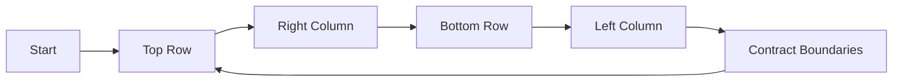

<h2><a href="https://leetcode.com/problems/spiral-matrix">54. Spiral Matrix</a></h2>

<p>Given an <code>m x n</code> <code>matrix</code>, return <em>all elements of the</em> <code>matrix</code> <em>in spiral order</em>.</p>

<p>&nbsp;</p>
<p><strong class="example">Example 1:</strong></p>

<pre><strong>Input:</strong> matrix = [[1,2,3],[4,5,6],[7,8,9]]
<strong>Output:</strong> [1,2,3,6,9,8,7,4,5]
</pre>

<p><strong class="example">Example 2:</strong></p>

<pre><strong>Input:</strong> matrix = [[1,2,3,4],[5,6,7,8],[9,10,11,12]]
<strong>Output:</strong> [1,2,3,4,8,12,11,10,9,5,6,7]
</pre>

<p>&nbsp;</p>
<p><strong>Constraints:</strong></p>

<ul>
	<li><code>m == matrix.length</code></li>
	<li><code>n == matrix[i].length</code></li>
	<li><code>1 &lt;= m, n &lt;= 10</code></li>
	<li><code>-100 &lt;= matrix[i][j] &lt;= 100</code></li>
</ul>


---

# 🛍️ Spiral-Matrix | Explained

## Approach 1: Iterative Boundary Contraction
### Intuition
The core idea behind this approach is to iteratively contract the boundaries of the matrix, starting from the outermost layer and moving inwards, while traversing the elements in a spiral order. This approach works by maintaining a set of pointers that represent the current boundaries of the matrix (top, bottom, left, and right) and iteratively moving these pointers to contract the boundaries.

### Algorithm Visualized

### Approach
The algorithm starts by initializing the boundaries of the matrix and an empty list to store the elements in spiral order. It then enters a loop that continues until all elements have been traversed. In each iteration, the algorithm traverses the top row from left to right, the right column from top to bottom, the bottom row from right to left, and the left column from bottom to top, while contracting the boundaries after each traversal.

### Detailed Code Analysis
The code starts by initializing the boundaries of the matrix and an empty list to store the elements in spiral order:
```java
List<Integer> list = new ArrayList<>();
int top = 0;
int bottom = matrix.length - 1;
int left = 0;
int right = matrix[0].length - 1;
```
The loop condition `while (top <= bottom && left <= right)` ensures that the algorithm continues until all elements have been traversed. The loop body is divided into four blocks, each responsible for traversing a specific part of the matrix:
```java
for (int i = left; i <= right; i++) {
    list.add(matrix[top][i]);
}
top++;
```
This block traverses the top row from left to right and adds the elements to the list.
```java
for (int i = top; i <= bottom; i++) {
    list.add(matrix[i][right]);
}
right--;
```
This block traverses the right column from top to bottom and adds the elements to the list.
```java
if (top <= bottom) {
    for (int i = right; i >= left; i--) {
        list.add(matrix[bottom][i]);
    }
    bottom--;
}
```
This block traverses the bottom row from right to left and adds the elements to the list, but only if the bottom row exists.
```java
if (left <= right) {
    for (int i = bottom; i >= top; i--) {
        list.add(matrix[i][left]);
    }
    left++;
}
```
This block traverses the left column from bottom to top and adds the elements to the list, but only if the left column exists.

### Code
```java
public List<Integer> spiralOrder(int[][] matrix) {
    List<Integer> list = new ArrayList<>();
    int top = 0;
    int bottom = matrix.length - 1;
    int left = 0;
    int right = matrix[0].length - 1;
    while (top <= bottom && left <= right) {
        for (int i = left; i <= right; i++) {
            list.add(matrix[top][i]);
        }
        top++;
        for (int i = top; i <= bottom; i++) {
            list.add(matrix[i][right]);
        }
        right--;
        if (top <= bottom) {
            for (int i = right; i >= left; i--) {
                list.add(matrix[bottom][i]);
            }
            bottom--;
        }
        if (left <= right) {
            for (int i = bottom; i >= top; i--) {
                list.add(matrix[i][left]);
            }
            left++;
        }
    }
    return list;
}
```
### Complexity
- **Time:** The time complexity of this approach is O(m \* n), where m and n are the number of rows and columns in the matrix, respectively, because each element is visited exactly once.
- **Space:** The space complexity of this approach is O(m \* n), where m and n are the number of rows and columns in the matrix, respectively, because the list used to store the elements in spiral order has a maximum size of m \* n.

## 🕵️‍♂️ Follow-up Questions (Optional)
Some common follow-up questions for this pattern include:
* How would you modify the algorithm to handle a non-rectangular matrix?
* Can you implement this algorithm using recursion instead of iteration?