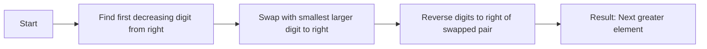

<h2><a href="https://leetcode.com/problems/next-greater-element-iii">556. Next Greater Element III</a></h2>

<p>Given a positive integer <code>n</code>, find <em>the smallest integer which has exactly the same digits existing in the integer</em> <code>n</code> <em>and is greater in value than</em> <code>n</code>. If no such positive integer exists, return <code>-1</code>.</p>

<p><strong>Note</strong> that the returned integer should fit in <strong>32-bit integer</strong>, if there is a valid answer but it does not fit in <strong>32-bit integer</strong>, return <code>-1</code>.</p>

<p>&nbsp;</p>
<p><strong class="example">Example 1:</strong></p>
<pre><strong>Input:</strong> n = 12
<strong>Output:</strong> 21
</pre><p><strong class="example">Example 2:</strong></p>
<pre><strong>Input:</strong> n = 21
<strong>Output:</strong> -1
</pre>
<p>&nbsp;</p>
<p><strong>Constraints:</strong></p>

<ul>
	<li><code>1 &lt;= n &lt;= 2<sup>31</sup> - 1</code></li>
</ul>


---

# 🛍️ Next-Greater-Element-III | Explained

## Approach 1: Single-Pass Digit Permutation
### Intuition
This approach works by finding the first decreasing digit from the right in the given number, then swapping it with the smallest larger digit to its right, and finally reversing the digits to the right of the swapped pair to get the next greater element. The idea is similar to finding the next permutation in a sequence of numbers, but with the constraint of maintaining the digits of the original number.

### Algorithm Visualized


### Approach
The algorithm can be broken down into four main steps:
1. Find the first decreasing digit from the right.
2. Swap this digit with the smallest larger digit to its right.
3. Reverse the digits to the right of the swapped pair.
4. The resulting number is the next greater element.

### Detailed Code Analysis
Let's dive into the code:
- Lines 3-4: `char digits[] = String.valueOf(n).toCharArray();` converts the input integer `n` into a character array `digits` for easier manipulation. The index `i` is initialized to the second last digit (`digits.length-2`).
- Lines 5-7: The while loop (`while(i>=0 && digits[i]>=digits[i+1])`) finds the first decreasing digit from the right by moving the index `i` to the left until it finds a digit that is smaller than the one to its right. If no such digit is found (`i==-1`), it means the input number is the largest possible number with its digits, so the function returns `-1`.
- Lines 10-13: The next while loop (`while(digits[nextint] <= digits[i])`) finds the smallest larger digit to the right of the digit at index `i`. This is done by moving the index `nextint` to the left from the end of the array.
- Lines 14-16: The digits at indices `i` and `nextint` are swapped using a temporary character `temp`.
- Lines 18-26: The while loop (`while(left<right)`) reverses the digits to the right of the swapped pair. This is done by swapping the digits at indices `left` and `right` and then moving the indices towards each other.
- Lines 27-32: The resulting character array is converted back into a long integer `result`. If `result` is larger than `Integer.MAX_VALUE`, the function returns `-1`, indicating that the next greater element is too large to fit into an integer. Otherwise, it returns the result as an integer.

### Code
```java
class Solution {
    public int nextGreaterElement(int n) {
        char digits[] = String.valueOf(n).toCharArray();
        int i = digits.length-2;
        while(i>=0 && digits[i]>=digits[i+1]){
            i--;
        }
        if(i==-1) return -1;

        int nextint = digits.length-1;
        while(digits[nextint] <= digits[i]){
           nextint--;
        }
        char temp = digits[i];
        digits[i] = digits[nextint];
        digits[nextint] = temp;

        int left = i+1;
        int right = digits.length-1;
        while(left<right){
            char temp1 = digits[left];
            digits[left] = digits[right];
            digits[right] = temp1;
            left++;
            right--;
        }
        long result = Long.parseLong(new String(digits));
        if(result > Integer.MAX_VALUE){
            return -1;
        }else{
            return (int) result;
        }
    }
}
```

### Complexity
- **Time:** O(k), where k is the number of digits in the input number `n`, because in the worst case we need to iterate through all the digits to find the first decreasing digit and to reverse the digits to the right of the swapped pair.
- **Space:** O(k), because we need to convert the input integer into a character array of size k.

## 🕵️‍♂️ Follow-up Questions (Optional)
- Q: What if the input number is negative?
  A: The current implementation does not handle negative numbers, as the problem statement does not specify how to handle them. However, we could modify the implementation to handle negative numbers by taking the absolute value of the input number and then applying the same algorithm.
- Q: How would you optimize the implementation for very large input numbers?
  A: For very large input numbers, we could optimize the implementation by using a more efficient data structure, such as a `StringBuilder`, to manipulate the digits of the input number. We could also use a more efficient algorithm, such as one that uses a stack to find the next greater element.