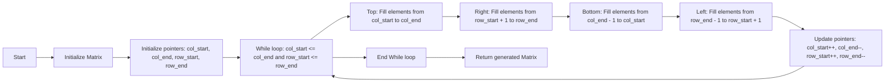

<h2><a href="https://leetcode.com/problems/spiral-matrix-ii">59. Spiral Matrix II</a></h2>

<p>Given a positive integer <code>n</code>, generate an <code>n x n</code> <code>matrix</code> filled with elements from <code>1</code> to <code>n<sup>2</sup></code> in spiral order.</p>

<p>&nbsp;</p>
<p><strong class="example">Example 1:</strong></p>

<pre><strong>Input:</strong> n = 3
<strong>Output:</strong> [[1,2,3],[8,9,4],[7,6,5]]
</pre>

<p><strong class="example">Example 2:</strong></p>

<pre><strong>Input:</strong> n = 1
<strong>Output:</strong> [[1]]
</pre>

<p>&nbsp;</p>
<p><strong>Constraints:</strong></p>

<ul>
	<li><code>1 &lt;= n &lt;= 20</code></li>
</ul>


---

# 🛍️ Spiral-Matrix-II | Explained

## Approach 1: Iterative Spiral Matrix Generation
### Intuition
The intuition behind this approach is to simulate the spiral pattern in a matrix by iterating over the elements in a layer-by-layer manner, starting from the outermost layer and moving inwards. This is similar to how a spiral is drawn, where you start from the outer edge and move in a spiral pattern towards the center. This approach works because it ensures that each element in the matrix is visited exactly once, and the spiral pattern is maintained by changing the direction of iteration after each layer.

### Algorithm Visualized


### Approach
The approach involves initializing a matrix with the given size `n` and four pointers: `col_start`, `col_end`, `row_start`, and `row_end`. These pointers represent the boundaries of the current layer being filled. The algorithm then enters a while loop, which continues until all layers have been filled. Inside the loop, the algorithm fills the elements in the current layer in a spiral pattern, starting from the top, then moving to the right, bottom, and finally the left. After filling each layer, the pointers are updated to move to the next inner layer.

### Detailed Code Analysis
The code starts by initializing a matrix `matrix` with size `n` and four pointers: `col_start`, `col_end`, `row_start`, and `row_end`. The `element` variable is used to keep track of the current element to be filled in the matrix.
```java
int[][] matrix = new int[n][n];
int col_start = 0, col_end = n - 1;
int row_start = 0, row_end = n - 1;
int element = 1;
```
The while loop checks if there are still layers to be filled, i.e., if `col_start` is less than or equal to `col_end` and `row_start` is less than or equal to `row_end`.
```java
while (col_start <= col_end && row_start <= row_end) {
    // ...
}
```
Inside the loop, the code fills the elements in the current layer in a spiral pattern. The first for loop fills the top elements from `col_start` to `col_end`.
```java
for (int j = col_start; j <= col_end; j++) {
    matrix[row_start][j] = element++;
}
```
The second for loop fills the right elements from `row_start + 1` to `row_end`.
```java
for (int i = row_start + 1; i <= row_end; i++) {
    matrix[i][col_end] = element++;
}
```
The third for loop fills the bottom elements from `col_end - 1` to `col_start`.
```java
for (int j = col_end - 1; j >= col_start; j--) {
    matrix[row_end][j] = element++;
}
```
The fourth for loop fills the left elements from `row_end - 1` to `row_start + 1`.
```java
for (int i = row_end - 1; i > row_start; i--) {
    matrix[i][col_start] = element++;
}
```
After filling each layer, the pointers are updated to move to the next inner layer.
```java
col_start++;
col_end--;
row_start++;
row_end--;
```
### Code
```java
class Solution {
    public int[][] generateMatrix(int n) {
        int[][] matrix = new int[n][n];
        int col_start = 0, col_end = n - 1;
        int row_start = 0, row_end = n - 1;
        int element = 1;
        while (col_start <= col_end && row_start <= row_end) {
            for (int j = col_start; j <= col_end; j++) {
                matrix[row_start][j] = element++;
            }
            
            for (int i = row_start + 1; i <= row_end; i++) {
                matrix[i][col_end] = element++;
            }
            
            for (int j = col_end - 1; j >= col_start; j--) {
                matrix[row_end][j] = element++;
            }
            
            for (int i = row_end - 1; i > row_start; i--) {
                matrix[i][col_start] = element++;
            }
            
            col_start++;
            col_end--;
            row_start++;
            row_end--;
        }
        return matrix;
    }
}
```

### Complexity
- **Time:** O(n^2), where n is the size of the matrix. This is because the algorithm fills each element in the matrix exactly once.
- **Space:** O(n^2), where n is the size of the matrix. This is because the algorithm creates a matrix of size n x n to store the result.