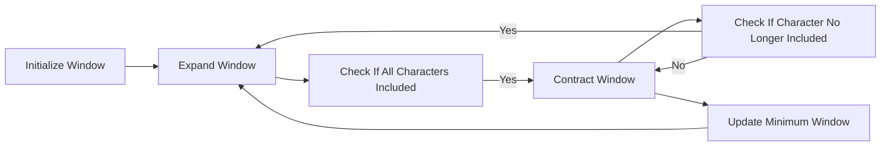

<h2><a href="https://leetcode.com/problems/minimum-window-substring">76. Minimum Window Substring</a></h2>

<p>Given two strings <code>s</code> and <code>t</code> of lengths <code>m</code> and <code>n</code> respectively, return <em>the <strong>minimum window</strong></em> <span data-keyword="substring-nonempty" class=" cursor-pointer relative text-dark-blue-s text-sm"><button type="button" aria-haspopup="dialog" aria-expanded="false" aria-controls="radix-_r_s_" data-state="closed" class=""><strong><em>substring</em></strong></button></span><em> of </em><code>s</code><em> such that every character in </em><code>t</code><em> (<strong>including duplicates</strong>) is included in the window</em>. If there is no such substring, return <em>the empty string </em><code>""</code>.</p>

<p>The testcases will be generated such that the answer is <strong>unique</strong>.</p>

<p>&nbsp;</p>
<p><strong class="example">Example 1:</strong></p>

<pre><strong>Input:</strong> s = "ADOBECODEBANC", t = "ABC"
<strong>Output:</strong> "BANC"
<strong>Explanation:</strong> The minimum window substring "BANC" includes 'A', 'B', and 'C' from string t.
</pre>

<p><strong class="example">Example 2:</strong></p>

<pre><strong>Input:</strong> s = "a", t = "a"
<strong>Output:</strong> "a"
<strong>Explanation:</strong> The entire string s is the minimum window.
</pre>

<p><strong class="example">Example 3:</strong></p>

<pre><strong>Input:</strong> s = "a", t = "aa"
<strong>Output:</strong> ""
<strong>Explanation:</strong> Both 'a's from t must be included in the window.
Since the largest window of s only has one 'a', return empty string.
</pre>

<p>&nbsp;</p>
<p><strong>Constraints:</strong></p>

<ul>
	<li><code>m == s.length</code></li>
	<li><code>n == t.length</code></li>
	<li><code>1 &lt;= m, n &lt;= 10<sup>5</sup></code></li>
	<li><code>s</code> and <code>t</code> consist of uppercase and lowercase English letters.</li>
</ul>

<p>&nbsp;</p>
<p><strong>Follow up:</strong> Could you find an algorithm that runs in <code>O(m + n)</code> time?</p>


---

# 🛍️ Minimum-Window-Substring | Explained

## Approach 1: Sliding Window Approach with Frequency Counting
### Intuition
The core idea behind this approach is to maintain a sliding window that represents the minimum substring of `s` that contains all characters of `t`. This is achieved by using two frequency count arrays: one for the target string `t` and one for the current window in `s`. The sliding window is expanded to the right until all characters in `t` are included, and then it is contracted from the left until a character in `t` is no longer included. This process is repeated to find the minimum window.

### Algorithm Visualized


### Approach
The algorithm works by first initializing the frequency count array for the target string `t` and the window in `s`. It then expands the window to the right, updating the frequency count array for the window. When all characters in `t` are included in the window, it contracts the window from the left, updating the frequency count array for the window. If a character in `t` is no longer included in the window, it expands the window to the right again.

### Detailed Code Analysis
The code initializes the frequency count array `tarfreq` for the target string `t` (lines 4-7). It then initializes the frequency count array `window` for the window in `s` and the variables `left`, `minlen`, `start`, and `req` to keep track of the minimum window (lines 8-12). The outer loop expands the window to the right (lines 13-32). Inside the loop, it checks if the current character is in `t` and updates the frequency count array `window` and the variable `req` accordingly (lines 14-18). If all characters in `t` are included in the window (`req == 0`), it contracts the window from the left, updating the frequency count array `window` and the variable `req` (lines 20-30). If the current window is smaller than the minimum window found so far, it updates the minimum window (lines 21-24).

### Code
```java
class Solution {
    public String minWindow(String s, String t) {
        if(s.length()<t.length()) return "";
        int tarfreq[] = new int[128];
        for(int i=0;i<t.length();i++){
            tarfreq[t.charAt(i)]++;
        }
        int left=0;
        int minlen = Integer.MAX_VALUE;
        int start = -1;
        int req = t.length();
        int window[] = new int[128];
        for(int right=0;right<s.length();right++){
            char rightidx = s.charAt(right);
            if(window[rightidx]<tarfreq[rightidx]){
                req--;
            }
            window[rightidx]++;
            while(req==0){
                int currlen = right-left+1;
                if(currlen < minlen){
                    minlen = currlen;
                    start = left;
                }
                char leftidx = s.charAt(left);
                window[leftidx]--;
                if(window[leftidx]<tarfreq[leftidx]){
                   req++;
                }
                left++;
            }
        }
        if(start==-1) return "";
        else return s.substring(start,start+minlen);
    }
}
```

### Complexity
- **Time:** O(|s| + |t|), where |s| is the length of the string `s` and |t| is the length of the string `t`, because we are scanning both strings once.
- **Space:** O(1), because the space used does not grow with the size of the input strings, as we are using a fixed-size array of size 128 to store the frequency counts.

## 🕵️‍♂️ Follow-up Questions (Optional)
1. How would you handle the case when the string `t` is empty?
   - You would return an empty string, as there is no minimum window that contains all characters of an empty string.
2. How would you optimize the solution if the string `s` is very large and the string `t` is very small?
   - You would use the same solution, as it has a linear time complexity with respect to the size of the string `s`. However, you could consider using a `HashMap` to store the frequency counts instead of an array, which would allow you to handle characters outside the ASCII range.