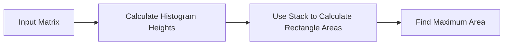

<h2><a href="https://leetcode.com/problems/maximal-rectangle">85. Maximal Rectangle</a></h2>

<p>Given a <code>rows x cols</code>&nbsp;binary <code>matrix</code> filled with <code>0</code>'s and <code>1</code>'s, find the largest rectangle containing only <code>1</code>'s and return <em>its area</em>.</p>

<p>&nbsp;</p>
<p><strong class="example">Example 1:</strong></p>

<pre><strong>Input:</strong> matrix = [["1","0","1","0","0"],["1","0","1","1","1"],["1","1","1","1","1"],["1","0","0","1","0"]]
<strong>Output:</strong> 6
<strong>Explanation:</strong> The maximal rectangle is shown in the above picture.
</pre>

<p><strong class="example">Example 2:</strong></p>

<pre><strong>Input:</strong> matrix = [["0"]]
<strong>Output:</strong> 0
</pre>

<p><strong class="example">Example 3:</strong></p>

<pre><strong>Input:</strong> matrix = [["1"]]
<strong>Output:</strong> 1
</pre>

<p>&nbsp;</p>
<p><strong>Constraints:</strong></p>

<ul>
	<li><code>rows == matrix.length</code></li>
	<li><code>cols == matrix[i].length</code></li>
	<li><code>1 &lt;= rows, cols &lt;= 200</code></li>
	<li><code>matrix[i][j]</code> is <code>'0'</code> or <code>'1'</code>.</li>
</ul>


---

# 🛍️ Maximal-Rectangle | Explained

## Approach 1: Histogram-Based Approach with Stack
### Intuition
This approach works by treating each row in the input matrix as the base for a histogram and then using a stack to efficiently calculate the area of the largest rectangle that can be formed. The intuition is that for each row, we can calculate the heights of the histogram bars by counting the consecutive '1's from the current row to the top. We then use a stack to keep track of the indices of the histogram bars and calculate the area of the largest rectangle that can be formed.

### Algorithm Visualized


### Approach
The approach involves the following steps:
1. Calculate the histogram heights for each row in the input matrix.
2. Use a stack to keep track of the indices of the histogram bars and calculate the area of the largest rectangle that can be formed.
3. Find the maximum area among all the rows.

### Detailed Code Analysis
Let's dive into the code:
- The `maximalRectangle` function takes a 2D char array `matrix` as input and returns the maximum area of a rectangle that can be formed.
- It first checks if the input matrix is empty and returns 0 if it is.
- It then initializes variables `row`, `col`, and `maxArea` to store the number of rows, number of columns, and the maximum area found so far, respectively.
- It creates an array `heights` of size `col` to store the histogram heights for each row.
- The outer loop iterates over each row in the input matrix.
- For each row, the inner loop iterates over each column and updates the `heights` array accordingly. If the current cell is '1', it increments the corresponding height in the `heights` array. If the current cell is '0', it resets the corresponding height to 0.
- After updating the `heights` array for the current row, it calls the `largerRectangularArea` function to calculate the maximum area of a rectangle that can be formed using the current `heights` array.
- The `largerRectangularArea` function uses a stack to keep track of the indices of the histogram bars and calculate the area of the largest rectangle that can be formed.
- It iterates over the `heights` array and pushes the indices of the bars onto the stack. If the current bar is smaller than the bar at the top of the stack, it pops the top bar from the stack and calculates the area of the rectangle that can be formed using the popped bar as the smallest bar.
- After iterating over the entire `heights` array, it pops any remaining bars from the stack and calculates the area of the rectangle that can be formed using the popped bar as the smallest bar.
- Finally, it returns the maximum area found.

### Code
```java
class Solution {
    public int maximalRectangle(char[][] matrix) {
        if(matrix.length==0) return 0;
        int row = matrix.length;
        int col = matrix[0].length;
        int maxArea = 0;
        int heights [] = new int[col];
        for(int i=0;i<row;i++){
            for(int j=0;j<col;j++){
                if(matrix[i][j]=='1'){
                    heights[j]++;
                }else{
                    heights[j]=0;
                }
            }
            maxArea = Math.max(maxArea,largerRectangularArea(heights));
        }
        return maxArea;
    }

    public static int largerRectangularArea(int heights[]){
        Stack<Integer> st = new Stack<>();
        int max = 0;
        for(int i=0;i<heights.length;i++){
            while (!st.isEmpty() && heights[i]<heights[st.peek()]){
                int height = heights[st.pop()];
                int width;
                if(st.isEmpty()) width = i;
                else width = i - st.peek() - 1;
                int area = height*width;
                max = Math.max(max,area);
            }
            st.push(i);
        }

        while(!st.isEmpty()){
            int height = heights[st.pop()];
            int width;
            if(st.isEmpty()) width = heights.length;
            else width = heights.length - st.peek() - 1;
            int area = height*width;
            max = Math.max(max,area);
        }
        return max;
    }
}
```

### Complexity
- **Time:** O(R*C) where R is the number of rows and C is the number of columns in the input matrix. This is because we are iterating over each cell in the matrix once.
- **Space:** O(C) where C is the number of columns in the input matrix. This is because we are using an array of size C to store the histogram heights for each row, and a stack to store the indices of the histogram bars. In the worst case, the stack can contain C elements.