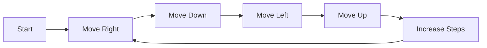

<h2><a href="https://leetcode.com/problems/spiral-matrix-iii">885. Spiral Matrix III</a></h2>

<p>You start at the cell <code>(rStart, cStart)</code> of an <code>rows x cols</code> grid facing east. The northwest corner is at the first row and column in the grid, and the southeast corner is at the last row and column.</p>

<p>You will walk in a clockwise spiral shape to visit every position in this grid. Whenever you move outside the grid's boundary, we continue our walk outside the grid (but may return to the grid boundary later.). Eventually, we reach all <code>rows * cols</code> spaces of the grid.</p>

<p>Return <em>an array of coordinates representing the positions of the grid in the order you visited them</em>.</p>

<p>&nbsp;</p>
<p><strong class="example">Example 1:</strong></p>

<pre><strong>Input:</strong> rows = 1, cols = 4, rStart = 0, cStart = 0
<strong>Output:</strong> [[0,0],[0,1],[0,2],[0,3]]
</pre>

<p><strong class="example">Example 2:</strong></p>

<pre><strong>Input:</strong> rows = 5, cols = 6, rStart = 1, cStart = 4
<strong>Output:</strong> [[1,4],[1,5],[2,5],[2,4],[2,3],[1,3],[0,3],[0,4],[0,5],[3,5],[3,4],[3,3],[3,2],[2,2],[1,2],[0,2],[4,5],[4,4],[4,3],[4,2],[4,1],[3,1],[2,1],[1,1],[0,1],[4,0],[3,0],[2,0],[1,0],[0,0]]
</pre>

<p>&nbsp;</p>
<p><strong>Constraints:</strong></p>

<ul>
	<li><code>1 &lt;= rows, cols &lt;= 100</code></li>
	<li><code>0 &lt;= rStart &lt; rows</code></li>
	<li><code>0 &lt;= cStart &lt; cols</code></li>
</ul>


---

# 🛍️ Spiral-Matrix-III | Explained

## Approach 1: Iterative SpiralTraversal
### Intuition
The core idea of this approach is to mimic the spiral pattern in a matrix by iterating in four directions (right, down, left, and up) while keeping track of the current position and number of steps to be taken in each direction. This approach works because it effectively covers all the cells in the matrix in a spiral order, starting from the given initial position.

### Algorithm Visualized


### Approach
The algorithm starts by initializing the current position to the given start position and the number of steps to 1. It then enters a loop where it iterates in the four directions (right, down, left, and up) while keeping track of the current position and the number of steps to be taken in each direction. After completing each cycle of four directions, the number of steps is incremented by 1.

### Detailed Code Analysis
The code initializes the `ans` array to store the positions of the cells in the spiral order. It starts by setting the first cell to the given start position (`rStart` and `cStart`). The `index` variable is used to keep track of the current position in the `ans` array.

The code then enters a while loop that continues until all cells in the matrix have been visited (`index < rows*cols`). Inside the loop, the code iterates in the four directions (right, down, left, and up) using four separate for loops.

In each for loop, the code checks if the current position is within the bounds of the matrix (`r>=0 && c>=0 && r<rows && c<cols`). If it is, the code sets the current cell in the `ans` array to the current position and increments the `index`.

After completing each cycle of four directions, the code increments the `steps` variable by 1.

### Code
```java
int[][] ans = new int [rows*cols][2];
int r = rStart;
int c = cStart;
ans[0][0] = rStart;
ans[0][1] = cStart;
int index = 1;
int steps = 1;
while(index < rows*cols){
    for(int i=0;i<steps;i++){
        c++;
        if(r>=0 && c>=0 && r<rows && c<cols){
            ans[index][0]=r;
            ans[index][1]=c;
            index++;
        }
    }
    for(int i=0;i<steps;i++){
        r++;
        if(r>=0 && c>=0 && r<rows && c<cols){
            ans[index][0]=r;
            ans[index][1]=c;
            index++;
        }
    }
    steps++;
    for(int i=0;i<steps;i++){
        c--;
        if(r>=0 && c>=0 && r < rows && c<cols){
            ans[index][0]=r;
            ans[index][1]=c;
            index++;
        }
    }
    for(int i=0;i<steps;i++){
        r--;
        if(r>=0 && c>=0 && r < rows && c<cols){
            ans[index][0]=r;
            ans[index][1]=c;
            index++;
        }
    }
    steps++;
}
```

### Complexity
- **Time:** O(rows*cols) because in the worst-case scenario, the algorithm visits each cell in the matrix once.
- **Space:** O(rows*cols) because the algorithm uses an array of size rows*cols to store the positions of the cells in the spiral order.

## 🕵️‍♂️ Follow-up Questions (Optional)
- What if the start position is outside the bounds of the matrix? The algorithm will simply ignore the start position and start from the first cell that is within the bounds of the matrix.
- How can we optimize the algorithm to handle very large matrices? We can use a more efficient data structure, such as a queue or a stack, to store the positions of the cells to be visited, instead of using an array of size rows*cols.